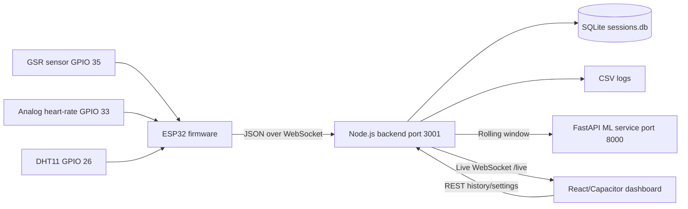

# BioPulse

BioPulse is an IoT-based biometric stress logging and analysis prototype for classroom and lab environments. It uses an ESP32 sensor node to collect physiological and environmental readings, streams them to a local Node.js backend, stores timestamped readings, visualizes live data in a React/Capacitor dashboard, and includes a basic ML pipeline for stress classification experiments.

The project is built for an IoT mini-project submission. The full technical report is available in [report.md](report.md).

## Current Prototype

The active implementation uses this pipeline:

```text
ESP32 sensor device -> WiFi/WebSocket -> Node.js backend -> SQLite/CSV/ML API
React/Capacitor dashboard -> WebSocket/REST -> Node.js backend
```

The BLE/mobile-gateway architecture is planned for a later upgrade, but the current working path is direct ESP32-to-laptop-server communication over WiFi.

## Problem Statement

Classroom stress is usually observed subjectively. Teachers may notice silence, low participation, or discomfort, but they do not get objective time-series evidence during a lecture, quiz, or lab activity. BioPulse collects biometric indicators such as heart rate, GSR, HRV, and environmental context so that classroom stress trends can be visualized live and analyzed later.

This is not a medical diagnosis system. It is an educational IoT prototype for sensing, logging, visualization, and basic analytics.

## Implemented Features

- ESP32 firmware for sensor sampling and WebSocket telemetry
- Analog heart-rate peak detection with BPM, IBI, and simplified HRV
- GSR reading through ESP32 ADC
- DHT11 temperature and humidity readings
- Node.js backend with Express, WebSocket, SQLite, and CSV export
- React/Capacitor mobile-style dashboard
- Live monitor, history, analysis, and settings screens
- Data cleaning and validity checks before analysis storage
- Python FastAPI ML service scaffold with CNN-LSTM and Random Forest tracks
- Technical report with architecture, flowcharts, data tables, statistics, and references

## Hardware

| Component | Current use | Pin/interface |
|---|---|---|
| ESP32 DevKit | Main IoT controller and WiFi node | Arduino/PlatformIO |
| GSR analog sensor | Skin conductance/stress-related signal | GPIO 35 ADC |
| Analog heart-rate sensor | Pulse waveform input | GPIO 33 ADC |
| DHT11 | Temperature and humidity context | GPIO 26 |
| Laptop/server | Local cloud/fog backend | WiFi LAN |
| Mobile/web dashboard | Live visualization and analysis | WebSocket/REST |

Earlier notes mention MAX30102 and a physical LED actuator. The current committed firmware uses an analog heart-rate input and does not yet drive a physical LED pin. The dashboard has LED-style stress indicators, and the backend has a `led_state` field ready for future physical LED integration.

## System Architecture



## Repository Layout

```text
.
|-- biopulse/
|   |-- firmware/
|   |   |-- platformio.ini
|   |   `-- src/main.cpp
|   |-- backend/
|   |   |-- server.js
|   |   |-- routes/
|   |   |-- package.json
|   |   `-- db/                 # local DB/CSV generated at runtime, ignored by git
|   `-- mobile-app/
|       |-- src/
|       |-- android/
|       |-- package.json
|       `-- vite.config.js
|-- ml_model/
|   |-- src/
|   |   |-- api.py
|   |   |-- preprocess.py
|   |   `-- train_pipeline.py
|   |-- models/                 # model artifacts ignored except lightweight config
|   `-- requirements_pipeline.txt
|-- report.md
|-- run-project.sh
|-- upgrade.md
|-- plan.md
`-- readme.md
```

## Data and GitHub Notes

This repository intentionally ignores local biometric data, training datasets, trained model artifacts, virtual environments, dependency folders, and generated build outputs.

Ignored examples:

- `biopulse/backend/db/*.db`
- `biopulse/backend/db/*.csv`
- `ml_model/data*/`
- `ml_model/**/*.pt`
- `ml_model/**/*.pkl`
- `node_modules/`
- Python virtual environments and `__pycache__/`
- Android/Capacitor build outputs

This keeps the GitHub repository small and avoids uploading sensitive biometric readings or large public datasets. Local data still exists on the development machine if it was already generated.

## Quick Start

### 1. Backend

```bash
cd biopulse/backend
npm install
npm start
```

Backend runs at:

```text
http://localhost:3001
ws://localhost:3001/live
```

Useful endpoints:

| Endpoint | Purpose |
|---|---|
| `POST /api/data` | HTTP telemetry ingest fallback |
| `GET /api/readings` | Latest readings |
| `GET /api/sessions` | Session summaries |
| `GET /api/ml/health` | ML service health proxy |

### 2. Mobile Dashboard

```bash
cd biopulse/mobile-app
npm install
npm run dev
```

Dashboard runs at:

```text
http://localhost:5173
```

In settings, set the backend/server IP to the laptop IP if testing from another device on the same WiFi network.

### 3. Run Both Core Services

From the repository root:

```bash
./run-project.sh
```

To also start the ML API when dependencies and model artifacts are available:

```bash
START_ML=1 ./run-project.sh
```

## ESP32 Firmware

Firmware path:

```text
biopulse/firmware/src/main.cpp
```

Before flashing, update these values in `main.cpp`:

```cpp
const char* WIFI_SSID = "YourWiFiName";
const char* WIFI_PASSWORD = "YourWiFiPassword";
const char* SERVER_IP = "192.168.1.100";
const int SERVER_PORT = 3001;
const char* STUDENT_ID = "S01";
```

Flash with PlatformIO:

```bash
cd biopulse/firmware
pio run --target upload
```

Serial output format:

```text
timestamp,heart_rate,hrv,gsr_pct,temperature,humidity,ibi_ms
```

## Telemetry Format

The ESP32 sends JSON like this to the backend:

```json
{
  "student_id": "S01",
  "timestamp": 1776833270312,
  "heart_rate": 86,
  "hrv": 228,
  "gsr": 1.1,
  "temperature": 28.6,
  "humidity": 32.9,
  "ibi_ms": 698,
  "spo2": 0,
  "stress_index": 0
}
```

The backend normalizes field names, filters invalid readings, appends raw rows to `reading_final.csv`, stores valid rows in SQLite/CSV, broadcasts live readings, and sends rolling windows to the ML service when enabled.

## Stress Scoring

The dashboard uses a simple project-level stress index:

```text
hr_norm  = clamp((heart_rate - 40) / (200 - 40), 0, 1)
gsr_norm = clamp(gsr / 12, 0, 1)
hrv_inv  = 1 - clamp((hrv - 5) / (200 - 5), 0, 1)

stress_index = 100 * (0.35 * hr_norm + 0.45 * gsr_norm + 0.20 * hrv_inv)
```

Stress labels:

| Stress index | Label | Dashboard status |
|---|---|---|
| 0 to 35 | CALM | Green |
| 36 to 65 | MODERATE | Yellow |
| 66 to 85 | STRESSED | Red |
| 86 to 100 | CRITICAL | Blinking/high alert |

## ML Pipeline

The ML code is in `ml_model/src`.

| File | Purpose |
|---|---|
| `preprocess.py` | Cleans readings and engineers rolling features |
| `train_pipeline.py` | Trains Track A and Track B models |
| `api.py` | FastAPI inference server |
| `models/feature_config.json` | Lightweight committed feature configuration |

Tracked model weights and training datasets are intentionally excluded from GitHub. To use ML locally, regenerate or restore the required artifacts:

```text
ml_model/models/scaler.pkl
ml_model/models/trackA_model.pt
ml_model/models/trackB_model.pkl
```

The current ML design uses:

- Track A: CNN-LSTM over 30-reading feature windows
- Track B: Random Forest over statistical window features
- Ensemble inference: weighted combination of Track A and Track B

## Android Build

```bash
cd biopulse/mobile-app
npm install
npm run build
npx cap sync android
```

Then open/build the Android project using Android Studio if needed.

## Project Report

The technical report in [report.md](report.md) includes:

- Introduction and literature review
- Problem definition and motivation
- System architecture and block diagram
- Hardware design
- Software flowcharts
- Communication protocol explanation
- Cloud architecture
- Data collection tables and graphs
- Mean, variance, and trend analysis
- ML proposal/basic implementation
- Challenges faced
- Security and privacy considerations
- Conclusion

## Security and Privacy

BioPulse handles biometric data, so the current LAN prototype should be used with care.

Current limitations:

- WebSocket traffic is plain `ws://` on local WiFi
- Backend APIs are not authenticated yet
- SQLite/CSV files are local and unencrypted
- Student IDs are simple pseudonyms such as `S01`

Recommended upgrades:

- Use HTTPS/WSS for remote deployment
- Add login/auth before cloud sync
- Use BLE pairing for ESP32-to-phone transport
- Store only consented and pseudonymous data
- Encrypt sensitive local and server storage where practical

## Roadmap

- Add physical RGB LED actuator support in ESP32 firmware
- Move ESP32-to-mobile communication from WiFi to BLE
- Add offline mobile session storage and sync queue
- Add authentication before server upload
- Add per-student baseline calibration
- Improve ML with real labels and confidence scoring
- Add a teacher/laptop dashboard for class-level summaries

## License

Academic mini-project prototype. Add a formal license before public reuse.
