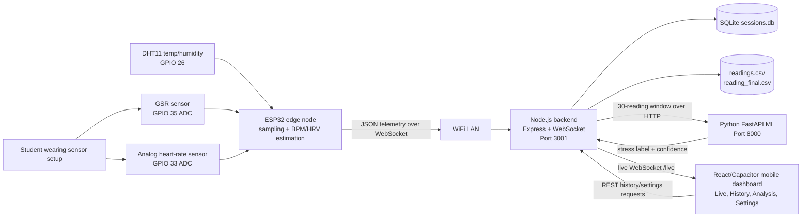
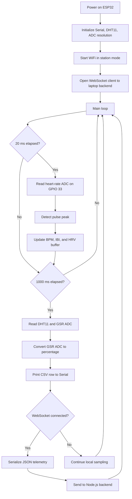
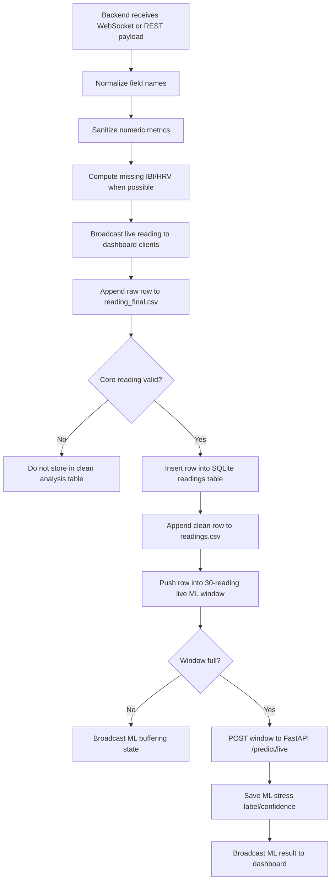
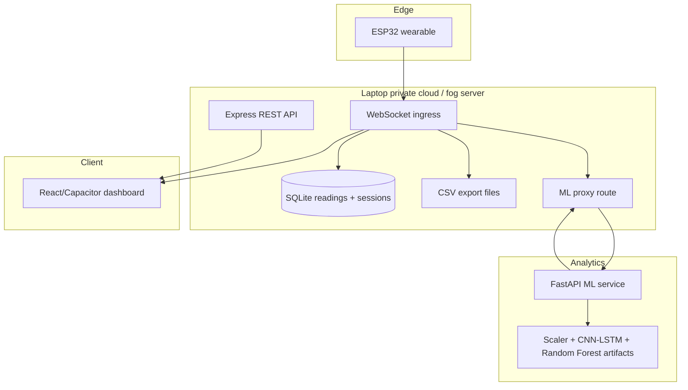
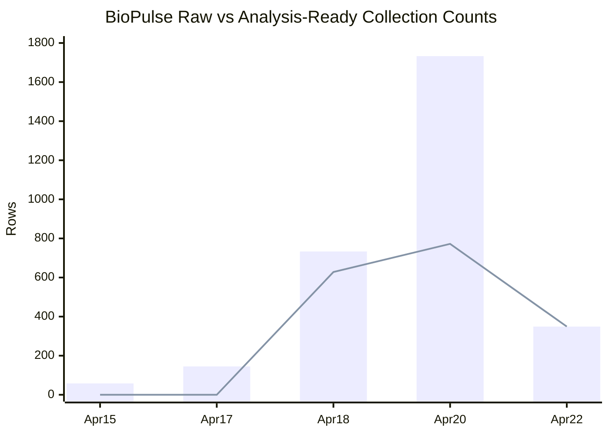

# BioPulse Technical Report

**Project:** Biometric Stress Logging and Analysis System  
**Course deliverable:** IoT Mini Project Technical Report  
**Prototype date reviewed:** 5 May 2026  
**Primary implementation evidence:** `biopulse/firmware/src/main.cpp`, `biopulse/backend/server.js`, `biopulse/mobile-app/src`, `ml_model/src`, and `biopulse/backend/db/sessions.db`

## Report Authenticity Note

This report is based on the actual BioPulse repository and the data currently present in the project workspace. The current active prototype uses an ESP32, an analog heart-rate input, a GSR analog input, a DHT11 temperature/humidity sensor, a Node.js WebSocket/REST backend, SQLite storage, a React/Capacitor dashboard, and a Python FastAPI ML service. Some earlier project notes mention a MAX30102 and physical LED actuator; however, the firmware currently committed in `biopulse/firmware/src/main.cpp` uses analog heart-rate sensing on GPIO 33 and does not yet drive a physical LED GPIO. The report therefore separates the implemented system from planned improvements.

## 1. Introduction

BioPulse is an end-to-end IoT system designed to monitor physiological signals that may correlate with student stress during classroom, lab, or quiz situations. In many classrooms, stress is observed subjectively: a teacher may notice silence, restlessness, or low participation, but these observations are not quantified. BioPulse attempts to add objective supporting data by collecting heart-rate, galvanic skin response (GSR), temperature, and humidity readings from a wearable ESP32-based prototype.

The system is not intended to diagnose medical stress or replace clinical assessment. Its purpose is educational and experimental: to demonstrate how sensors, embedded processing, wireless communication, cloud-style storage, dashboard visualization, and basic machine learning can be integrated into a real IoT pipeline. In the current implementation, the ESP32 samples sensors, sends JSON telemetry over WiFi/WebSocket to a Node.js backend, stores data in SQLite and CSV files, broadcasts readings to a mobile-style dashboard, and optionally forwards rolling windows of data to a Python ML inference service.

The main target users are students, teachers, and project evaluators in a local classroom or lab environment. The prototype helps answer questions such as: are students showing higher physiological activation during a quiz than during a normal lecture, does stress remain high for a long period, and can a low-cost IoT system produce useful time-series evidence?

The project satisfies the major IoT design requirements:

| Requirement | BioPulse implementation |
|---|---|
| Embedded controller | ESP32 |
| Sensors | GSR analog sensor, analog heart-rate sensor, DHT11 temperature/humidity sensor |
| Actuator/status output | Dashboard LED-style status indicators implemented; physical LED actuator is planned but not yet present in current firmware |
| Communication protocol | WiFi + WebSocket JSON; REST HTTP fallback through `/api/data` |
| Cloud/storage layer | Node.js server with SQLite database and CSV export; suitable for migration to a hosted cloud VM/API |
| Dashboard | React/Capacitor mobile application with Live Monitor, History, Analysis, and Settings screens |
| Data analysis | Mean, variance, daily trend, validity filtering, and estimated stress index |
| ML enhancement | Python FastAPI service with feature engineering, CNN-LSTM Track A, Random Forest Track B, and ensemble inference design |

## 2. Literature Review

Wearable stress recognition normally depends on physiological signals that change with sympathetic nervous system activation. Heart activity, heart-rate variability, skin conductance, and temperature are common signals because they can be captured without invasive equipment.

Healey and Picard studied stress detection in real-world driving tasks using physiological sensors. Their work is important for BioPulse because it shows that stress estimation is more useful when physiological signals are observed continuously during a real activity rather than only in a controlled laboratory. The paper supports the project decision to log time-series physiological readings instead of only asking students to self-report how they feel after a session.

Schmidt et al. introduced WESAD, a public wearable dataset for stress and affect detection. WESAD includes wearable physiological signals such as electrodermal activity, blood volume pulse, temperature, and accelerometer data. This directly influenced the BioPulse ML plan: the current ML pipeline in `ml_model/src/preprocess.py` engineers rolling statistical features from heart rate, GSR, HRV, temperature, and humidity, and the training pipeline uses 30-reading windows similar to wearable time-series classification.

A broader review by Schmidt et al. on wearable-based affect recognition emphasizes that wearable stress recognition has practical value but also faces major limitations: signal noise, person-to-person variation, context dependence, and the difficulty of obtaining reliable labels. This is relevant to BioPulse because students have different resting heart rates and skin conductance baselines. A fixed threshold may be acceptable for a mini-project prototype, but a deployment should use per-student calibration and event labels such as "lecture", "quiz", "break", or "lab activity".

The communication design also follows established Internet protocols. The WebSocket protocol, standardized in RFC 6455, provides full-duplex communication over a single TCP connection after an HTTP upgrade handshake. This is useful for BioPulse because the dashboard needs low-latency live readings without repeatedly polling a REST endpoint.

**References used in this literature review are listed at the end of the report.**

## 3. Problem Definition

### 3.1 Local Problem

In a classroom or lab setting, student stress is difficult to observe accurately. A student may look calm but have elevated physiological activation; another student may appear anxious but may simply be tired or distracted. Teachers usually receive feedback only after tests, assignments, or informal conversations. This delay makes it difficult to identify stressful learning moments while they are happening.

The local problem addressed by BioPulse is:

> How can a low-cost IoT wearable system collect and visualize physiological signals from students during classroom activities so that stress-related trends can be observed in real time and analyzed later?

### 3.2 Target Users

| User | Need |
|---|---|
| Student | Non-invasive feedback about stress patterns during study, lab work, or quizzes |
| Teacher | Class-level or student-level physiological trend visibility during learning activities |
| Research/project evaluator | Stored timestamped data, graphs, and a reproducible IoT architecture |
| Developer/team | A modular prototype that can be improved with BLE, authentication, better ML, and cloud deployment |

### 3.3 Constraints

| Constraint | Impact on design |
|---|---|
| Low cost | ESP32 and simple analog sensors are preferred over medical-grade devices |
| Wearability | Sensor wiring must be compact and comfortable |
| Sensor noise | GSR and heart-rate signals require filtering, warm-up handling, and range checks |
| Privacy | Biometric readings must be treated as sensitive personal data |
| Latency | Live dashboard requires near real-time communication |
| Power | ESP32 WiFi consumes more power than BLE; BLE is planned as a future improvement |
| Validity | Stress estimation must be presented as an indicator, not a medical diagnosis |

## 4. Motivation

Stress affects attention, participation, learning quality, and student well-being. In classrooms, teachers often adjust speed or teaching style based on visible feedback, but visible feedback can be incomplete. A system such as BioPulse provides an additional source of evidence by showing time-aligned physiological changes during specific activities.

The motivation is not to monitor students in a punitive way. The goal is to create a supportive feedback mechanism. For example, if many students show an increase in stress during a particular explanation or quiz segment, the teacher can slow down, revisit the topic, or provide a break. If only one student's readings are unusual, the system should not label that student publicly; instead, the data can be used privately and ethically.

The project also has strong IoT learning value. It combines embedded sensing, wireless networking, backend engineering, database storage, mobile UI design, and ML analytics. The system therefore demonstrates not just individual coding components but a complete IoT pipeline:

1. Sense physiological and environmental variables.
2. Process basic values at the edge device.
3. Transmit structured telemetry.
4. Store time-series data.
5. Visualize readings live.
6. Analyze historical trends.
7. Propose ML-based stress classification.

## 5. System Architecture

### 5.1 Current Active Architecture

The current active architecture, described in `upgrade.md`, is:

```text
ESP32 Sensor Device -> Laptop Node.js Server -> SQLite / CSV / ML API
Mobile App Dashboard -> Laptop Node.js Server live WebSocket
```

The ESP32 directly connects to the same WiFi network as the laptop server. It sends readings to the backend using WebSocket JSON. The backend stores valid readings in SQLite, appends raw readings to CSV, broadcasts live data to connected dashboard clients, and forwards a rolling 30-reading window to the ML service when enough valid samples are available.

### 5.2 Block Diagram



### 5.3 Layered Architecture

| Layer | Component | Responsibility |
|---|---|---|
| Physical sensing layer | GSR, analog heart-rate sensor, DHT11 | Capture physiological and environmental signals |
| Edge layer | ESP32 firmware | Read sensors, estimate BPM/IBI/HRV, format CSV and JSON |
| Access network | WiFi LAN | Connect ESP32, laptop server, and dashboard |
| Application transport | WebSocket and HTTP REST | Stream live data and expose APIs |
| Storage layer | SQLite and CSV files | Store readings, sessions, raw backups, and exports |
| Analytics layer | Node preprocessing and Python FastAPI ML | Validate readings, maintain rolling windows, infer labels |
| Presentation layer | React/Capacitor dashboard | Live monitoring, history, analysis, settings |

## 6. Hardware Design

### 6.1 Implemented Hardware Components

| Component | Current role | Interface/pin | Notes |
|---|---|---|---|
| ESP32 DevKit | Main microcontroller and WiFi node | WiFi, ADC, GPIO | Runs firmware in `biopulse/firmware/src/main.cpp` |
| GSR analog sensor | Measures skin conductance change | GPIO 35 ADC | Raw ADC converted to percentage using `rawGSR / 4095 * 100` |
| Analog heart-rate sensor | Measures pulse waveform | GPIO 33 ADC | Peak detection estimates BPM and IBI |
| DHT11 | Measures temperature and humidity | GPIO 26 | Used to add environmental context |
| Laptop/server | Local cloud/fog node | WiFi LAN | Runs Node.js backend, SQLite, and optional ML API |
| Android/mobile dashboard | Visualization client | WebSocket to backend | React/Capacitor app |

### 6.2 Actuator/Status Design

The project design includes a stress status indicator. The current mobile app implements LED-style visual indicators for calm, alert, and stressed states in `LiveMonitor.jsx`, and the backend schema contains a `led_state` field. The current ESP32 firmware does not yet assign a physical LED GPIO. For a complete hardware demonstration, an RGB LED or three single-color LEDs should be connected with current-limiting resistors.

Recommended physical LED mapping:

| Stress range | LED state | Meaning |
|---|---|---|
| 0 to 35 | Green | Calm |
| 36 to 65 | Yellow | Moderate |
| 66 to 85 | Red | Stressed |
| 86 to 100 | Blinking red | Critical |

Recommended implementation: add LED pins to the firmware and set the LED state after the stress index is computed on the edge or returned by the backend. This would make the actuator requirement visible on the physical prototype instead of only on the dashboard.

### 6.3 Sensor Signal Processing

The firmware uses two timing loops:

| Loop | Interval | Purpose |
|---|---:|---|
| Heart-rate sampling | Approximately 20 ms | Poll analog pulse waveform at about 50 Hz for peak detection |
| Telemetry transmission | 1000 ms | Read DHT11 and GSR, print CSV, send JSON to backend |

Heart-rate processing uses a threshold peak detector. When the analog pulse value crosses `PEAK_THRESHOLD` and the previous beat was more than `MIN_BEAT_GAP` ago, the firmware calculates:

```text
IBI_ms = current_time_ms - last_peak_time_ms
BPM = 60000 / IBI_ms
```

The firmware also calculates a simplified RMSSD-style HRV value from the last eight IBI values. Because this is a simple prototype algorithm, the threshold must be tuned for the actual sensor, finger placement, lighting, and wiring.

### 6.4 Hardware Limitations

The hardware design is low-cost and suitable for a mini-project, but it has limitations:

| Limitation | Effect |
|---|---|
| Analog pulse sensor is sensitive to movement | False peaks can create incorrect BPM |
| GSR depends on finger pressure and skin moisture | Readings vary between students and sessions |
| DHT11 is slow and low precision | Environmental readings are useful for context but not high accuracy |
| WiFi uses more power than BLE | Battery life will be limited compared with BLE |
| Physical LED not yet implemented in firmware | Actuator behavior must be added before final hardware demo |

## 7. Software Flowchart

### 7.1 ESP32 Firmware Flow



### 7.2 Backend and Dashboard Flow



## 8. Communication Protocol Explanation

### 8.1 Protocol Stack

| Layer | Protocol/technology | BioPulse use |
|---|---|---|
| Sensor interface | ADC and DHT digital signal | ESP32 reads GSR, heart-rate waveform, temperature, and humidity |
| Access network | WiFi | ESP32 and dashboard communicate with laptop server on LAN |
| Network | IPv4 | Local IP addressing, for example `192.168.1.100` |
| Transport | TCP | Reliable byte stream for WebSocket and HTTP |
| Application live stream | WebSocket | ESP32 sends telemetry; dashboard receives live updates |
| Application request/response | HTTP REST | `/api/data`, `/api/readings`, `/api/sessions`, `/api/ml/*` |
| Payload format | JSON and CSV | JSON for live telemetry, CSV for serial/debug/export data |

### 8.2 Why WebSocket Was Chosen

WebSocket is appropriate for live biometric monitoring because it keeps one connection open and allows the server and client to exchange messages without repeated HTTP polling. This reduces latency and overhead for the dashboard. In BioPulse:

| Connection | Endpoint | Purpose |
|---|---|---|
| ESP32 to backend | `ws://<server-ip>:3001/` | Send live telemetry JSON |
| Dashboard to backend | `ws://<server-ip>:3001/live` | Receive broadcast readings and ML results |
| Serial bridge fallback | `http://localhost:3001/api/data` | Send parsed Serial Monitor CSV rows using HTTP POST |
| Node to ML API | `http://localhost:8000/predict/live` | Send rolling 30-reading windows |

### 8.3 Telemetry Payload

The firmware currently sends a JSON object similar to:

```json
{
  "student_id": "S01",
  "timestamp": 1776833270312,
  "heart_rate": 86,
  "hrv": 228,
  "gsr": 1.1,
  "temperature": 28.6,
  "humidity": 32.9,
  "ibi_ms": 698,
  "spo2": 0,
  "stress_index": 0
}
```

The backend normalizes both `snake_case` and `camelCase` fields, filters invalid values, stores readings, and broadcasts a client-friendly payload. It also keeps a separate raw CSV log so that warm-up and dropout behavior can be inspected instead of silently hidden.

### 8.4 Communication Justification

| Criterion | WiFi/WebSocket result |
|---|---|
| Range | Good inside classroom or lab WiFi coverage |
| Bandwidth | More than enough for 1 Hz JSON telemetry |
| Latency | Low enough for live dashboard use |
| Cost | No extra radio module because ESP32 has WiFi |
| Power | Higher than BLE, acceptable for prototype but not ideal for a wearable |
| Complexity | Easier to implement quickly than BLE pairing and mobile permissions |

The planned future architecture moves the ESP32-to-phone link to BLE. BLE would reduce power consumption and allow the phone to act as the gateway when the laptop/server is not directly reachable.

## 9. Cloud Architecture

### 9.1 Current Cloud/Fog Layer

In the current prototype, the laptop server acts as a private cloud/fog node on the local network. It provides the same basic cloud functions that would later be deployed to a public cloud instance:

| Cloud function | Current implementation |
|---|---|
| Device ingestion | Node.js WebSocket server on port 3001 |
| REST API | Express endpoints under `/api/*` |
| Time-series storage | SQLite database at `biopulse/backend/db/sessions.db` |
| Export storage | `readings.csv` and `reading_final.csv` |
| ML inference service | FastAPI service expected at port 8000 |
| Dashboard service | React/Capacitor app connecting to server IP |

### 9.2 Cloud Data Flow



### 9.3 Future Cloud Deployment

For a production-style version, the current backend can be deployed to a hosted cloud VM or platform-as-a-service. The recommended future architecture is:

1. ESP32 sends data to the mobile app over BLE.
2. Mobile app stores sessions locally while offline.
3. Mobile app uploads sessions to a cloud API over HTTPS after login.
4. Cloud API stores data in a managed database.
5. Teacher/research dashboard reads only authorized and anonymized data.

This future design is more secure because the ESP32 no longer exposes live biometric telemetry directly over WiFi, and the server can reject unauthenticated uploads.

## 10. Data Collection

### 10.1 Data Sources

The project contains three important data stores:

| Data source | Purpose | Notes |
|---|---|---|
| `sessions.db` | Primary SQLite storage | Used for five collection-date count and analysis |
| `readings.csv` | Clean CSV export | Stores readings that passed backend persistence checks |
| `reading_final.csv` | Raw CSV backup | Keeps all rows including warm-up/dropout values; currently covers 20 Apr and 22 Apr 2026 |

The report analysis uses SQLite `sessions.db` as the primary source because it contains timestamped rows from five collection dates: 15 Apr, 17 Apr, 18 Apr, 20 Apr, and 22 Apr 2026. The first two dates contain calibration-stage rows where heart-rate values were raw ADC-like values rather than valid BPM, so they are counted in raw collection but excluded from analysis-ready statistics.

### 10.2 Raw Collection Summary

| Date | Raw rows in SQLite | Complete analysis-ready rows | Notes |
|---|---:|---:|---|
| 2026-04-15 | 58 | 0 | Calibration rows; heart-rate values are raw analog magnitudes, not BPM |
| 2026-04-17 | 145 | 0 | Calibration/test rows; excluded from analysis-ready table |
| 2026-04-18 | 733 | 628 | Valid HR/GSR/temp/humidity rows available |
| 2026-04-20 | 1733 | 772 | Mixed valid rows and warm-up/dropout rows |
| 2026-04-22 | 349 | 349 | Valid data during later test session |
| **Total** | **3018** | **1749** | Five collection dates, three analysis-ready dates |

### 10.3 Sample Readings

The following rows are evenly sampled from the analysis-ready dataset. Stress index is estimated using the project formula described in Section 11 because most stored rows do not yet contain persisted ML output.

| Received at UTC | HR BPM | GSR % | HRV ms | Temp C | Humidity % | Estimated stress |
|---|---:|---:|---:|---:|---:|---:|
| 2026-04-18T20:15:07.852Z | 43 | 7.04 | 129.5* | 27.6 | 50.3 | 34.3 |
| 2026-04-18T20:22:11.798Z | 89 | 5.08 | 129.5* | 27.3 | 50.6 | 37.0 |
| 2026-04-18T20:44:25.870Z | 72 | 4.40 | 129.5* | 27.4 | 50.1 | 30.7 |
| 2026-04-18T20:52:37.908Z | 136 | 7.04 | 129.5* | 27.3 | 50.2 | 54.6 |
| 2026-04-20T05:35:25.559Z | 95 | 0.68 | 129.5* | 27.8 | 46.9 | 21.8 |
| 2026-04-20T05:42:05.512Z | 70 | 2.83 | 129.5* | 27.2 | 48.0 | 24.4 |
| 2026-04-20T09:03:11.222Z | 102 | 2.44 | 202.0 | 25.0 | 40.6 | 22.7 |
| 2026-04-20T09:25:36.072Z | 167 | 0.88 | 114.0 | 25.0 | 40.5 | 39.9 |
| 2026-04-22T04:21:18.331Z | 130 | 2.00 | 38.0 | 29.0 | 32.2 | 43.8 |
| 2026-04-22T04:48:06.368Z | 65 | 1.70 | 222.0 | 28.6 | 32.3 | 11.8 |

`*` HRV missing values were filled with the median available HRV value for stress estimation.

### 10.4 Data Collection Graphs

Raw rows and complete valid rows:

```text
Date         Raw rows                         Complete rows
2026-04-15  # 58                              0
2026-04-17  ### 145                           0
2026-04-18  ############### 733               ############ 628
2026-04-20  ################################# 1733          ############### 772
2026-04-22  ####### 349                       ####### 349
```

Daily average heart rate and estimated stress for analysis-ready days:

```text
Date         Avg HR BPM   Avg stress
2026-04-18  85.03        34.74
2026-04-20  84.95        26.30
2026-04-22  106.98       35.53

Avg HR:      Apr18 ######## 85.03 | Apr20 ######## 84.95 | Apr22 ########### 106.98
Avg stress:  Apr18 ####### 34.74  | Apr20 ##### 26.30     | Apr22 ####### 35.53
```

Mermaid chart version for renderers that support `xychart-beta`:



## 11. Data Analysis

### 11.1 Cleaning Rules

The backend and ML preprocessing use range checks to remove impossible or low-quality values. The analysis-ready table in this report used the following practical rules:

| Field | Rule |
|---|---|
| Heart rate | 40 to 200 BPM |
| GSR | Greater than or equal to 0.5 percent |
| Temperature | 10 to 60 C |
| Humidity | 1 to 100 percent |
| HRV/IBI | Used when available; missing HRV filled only for estimated stress calculation |

Calibration-stage rows from 15 Apr and 17 Apr were not included in mean/variance calculations because their heart-rate values were analog magnitudes around 1800 to 1900 rather than BPM.

### 11.2 Mean and Variance

The following statistics are population variance values computed from the 1749 analysis-ready rows in SQLite.

| Metric | Count | Mean | Variance | Std. dev. | Min | Max |
|---|---:|---:|---:|---:|---:|---:|
| Heart rate BPM | 1749 | 89.371 | 936.801 | 30.607 | 40.000 | 200.000 |
| GSR % | 1749 | 3.549 | 3.926 | 1.981 | 0.587 | 12.023 |
| HRV ms | 704 | 150.896 | 7600.783 | 87.182 | 23.000 | 393.000 |
| Temperature C | 1749 | 27.374 | 1.803 | 1.343 | 24.600 | 31.200 |
| Humidity % | 1749 | 44.076 | 56.254 | 7.500 | 27.500 | 68.700 |
| IBI ms | 704 | 708.355 | 65486.840 | 255.904 | 303.000 | 1429.000 |
| Estimated stress index | 1749 | 31.176 | 138.370 | 11.763 | 3.955 | 66.596 |

### 11.3 Stress Index Formula Used for Analysis

The dashboard utility `biopulse/mobile-app/src/utils/stressAlgorithm.js` defines a stress index from normalized heart rate, GSR, and inverse HRV:

```text
hr_norm  = clamp((heart_rate - 40) / (200 - 40), 0, 1)
gsr_norm = clamp(gsr / 12, 0, 1)
hrv_inv  = 1 - clamp((hrv - 5) / (200 - 5), 0, 1)

stress_index = 100 * (0.35 * hr_norm + 0.45 * gsr_norm + 0.20 * hrv_inv)
```

This formula is a project scoring rule, not a clinical diagnosis. It is useful for comparison inside the same prototype because it combines the signals in a consistent way.

### 11.4 Daily Trends

| Date | Valid rows | Avg HR | Avg GSR | Avg HRV | Avg temp | Avg humidity | Avg IBI | Avg estimated stress | Label distribution |
|---|---:|---:|---:|---:|---:|---:|---:|---:|---|
| 2026-04-18 | 628 | 85.03 | 4.71 | N/A | 27.38 | 50.30 | N/A | 34.74 | 357 calm, 268 moderate, 3 stressed |
| 2026-04-20 | 772 | 84.95 | 2.89 | 180.71 | 26.60 | 44.80 | 803.86 | 26.30 | 627 calm, 145 moderate |
| 2026-04-22 | 349 | 106.98 | 2.92 | 120.57 | 29.09 | 31.29 | 611.21 | 35.53 | 156 calm, 193 moderate |

Observed trend:

| Metric | Trend over analysis-ready sequence |
|---|---|
| Heart rate | Increased by about 1.45 BPM per 100 analysis samples |
| GSR | Decreased by about 0.16 percentage points per 100 analysis samples |
| Temperature | Nearly stable, increasing about 0.02 C per 100 samples |
| Humidity | Decreased by about 1.25 percentage points per 100 samples |

The strongest visible pattern is on 22 Apr 2026: average heart rate increased to about 107 BPM while humidity was lower and temperature was higher than earlier sessions. The estimated stress index also moved upward from 26.30 on 20 Apr to 35.53 on 22 Apr. This does not prove psychological stress by itself, but it indicates higher physiological activation during that session.

### 11.5 Anomalies and Data Quality Observations

1. Rows from 15 Apr and 17 Apr contain heart-rate values that look like raw ADC magnitudes, not BPM. They are useful evidence of calibration but should not be mixed into final stress analysis.
2. `reading_final.csv` intentionally stores warm-up rows with zero heart rate and zero GSR. These rows are useful for debugging sensor startup behavior but should be excluded from analysis-ready statistics.
3. HRV is missing in many early valid rows and unusually high in some later rows. The ML preprocessing clips HRV to a practical range and fills missing values with a median. A better final implementation should calculate HRV after a stable number of beats and mark low-confidence readings.
4. The GSR observed range is mostly low, around 0.5 to 12 percent, so the dashboard formula uses 12 percent as the local normalization upper bound rather than 100 percent.

## 12. ML Proposal / Basic Implementation

### 12.1 Current ML Implementation

The repository already contains a basic ML implementation:

| File | Role |
|---|---|
| `ml_model/src/preprocess.py` | Cleans raw data and engineers 16 features |
| `ml_model/src/train_pipeline.py` | Builds sliding windows, trains models, saves artifacts |
| `ml_model/src/api.py` | FastAPI inference server |
| `ml_model/models/feature_config.json` | Stores sequence length and feature list |
| `ml_model/models/scaler.pkl` | StandardScaler artifact |
| `ml_model/models/trackA_model.pt` | CNN-LSTM model artifact |
| `ml_model/models/trackB_model.pkl` | Random Forest model artifact |
| `biopulse/backend/routes/ml.js` | Node proxy routes for ML API |

The model uses a 30-reading sequence length and 16 engineered features:

```text
hr_mean_30s, hr_std_30s, hr_delta, hr_max_30s,
gsr_mean_30s, gsr_std_30s, gsr_delta, gsr_peak_count,
hrv_mean_30s, hrv_drop,
heat_index, temp_delta, humidity_delta,
gsr_hr_product, hrv_temp_ratio,
session_progress
```

### 12.2 Track A and Track B

| Track | Model | Purpose |
|---|---|---|
| Track A | CNN-LSTM neural network | Learn temporal patterns from 30-reading feature windows |
| Track B | Random Forest | Learn from statistical summaries such as mean, standard deviation, min, max, and slope |
| Ensemble | 70 percent Track A + 30 percent Track B | Combine temporal and classical ML confidence |

The FastAPI service returns:

```json
{
  "stress_class": 1,
  "stress_label": "MODERATE",
  "confidence": 0.83,
  "stress_index": 42.6,
  "probabilities": {
    "CALM": 0.12,
    "MODERATE": 0.83,
    "STRESSED": 0.04,
    "CRITICAL": 0.01
  },
  "model_mode": "ensemble"
}
```

### 12.3 Current Labeling Method

At present, the training labels are pseudo-labels generated by a rule-based stress formula. This is acceptable as a basic implementation for a mini-project, but it should not be presented as medically validated. The class labels are:

| Label | Stress index range |
|---|---|
| CALM | 0 to 35 |
| MODERATE | 36 to 65 |
| STRESSED | 66 to 85 |
| CRITICAL | 86 to 100 |

### 12.4 Proposed ML Improvements

The most important improvement is to collect real labels. For example, each session should include event markers:

| Event label | Example use |
|---|---|
| Baseline | Student sitting quietly before activity |
| Lecture | Normal teaching period |
| Quiz | Timed assessment |
| Lab task | Hands-on work |
| Break/recovery | Low-pressure recovery period |

After that, the ML pipeline should:

1. Build a per-student baseline for HR, GSR, and HRV.
2. Train using event labels and self-reported stress scores.
3. Evaluate with train/test split by session, not by random row, to avoid leakage.
4. Report accuracy, precision, recall, and F1-score for each class.
5. Add confidence scoring so noisy sensor data is not overinterpreted.

## 13. Challenges Faced

| Challenge | Evidence in project | Impact | Mitigation |
|---|---|---|---|
| Heart-rate calibration | Early rows contain values around 1800 to 1900 instead of BPM | Invalid data if treated as heart rate | Use peak detection, range filtering, and clear calibration stage labels |
| GSR variability | GSR observed mostly between 0.5 and 12 percent | Generic 0 to 100 scaling would hide meaningful variation | Normalize using project-observed range and collect per-student baselines |
| HRV warm-up | HRV requires multiple beat intervals | Missing or unstable early HRV | Buffer enough IBI values before saving high-confidence HRV |
| WiFi dependency | ESP32 sends directly to laptop server | Less wearable-friendly and higher power | Future BLE phone gateway architecture |
| Physical actuator gap | `led_state` exists in backend and dashboard, but no physical LED pin in firmware | Hardware demo may not satisfy actuator requirement yet | Add RGB LED wiring and firmware state mapping |
| ML label quality | Current labels are rule-based pseudo-labels | Model may learn the formula rather than true stress | Add real session labels and self-report ground truth |
| Privacy/security | Current endpoints are unauthenticated | Biometric data could be spoofed or exposed on LAN | Add authentication, HTTPS/WSS, consent, and access control |

## 14. Security & Privacy Considerations

BioPulse handles biometric signals. Even if the system is a student prototype, heart rate, stress estimates, timestamps, and student IDs should be treated as sensitive data.

### 14.1 Current Security State

| Area | Current state |
|---|---|
| ESP32 transport | Plain WebSocket over local WiFi |
| Backend API | No authentication in current `server.js` |
| Dashboard access | Any client with server IP can connect to `/live` |
| Storage | SQLite and CSV files stored locally without encryption |
| Student identity | Uses simple IDs such as `S01` |
| ML API | Local FastAPI service without auth |

### 14.2 Privacy Risks

| Risk | Example |
|---|---|
| Unauthorized viewing | Another device on the LAN connects to `/live` |
| Payload spoofing | A fake client sends false telemetry to `/api/data` |
| Identity leakage | Student ID and stress trend appear in exported CSV |
| Overinterpretation | A teacher treats stress index as a medical fact |
| Long retention | Sensitive data remains in CSV/database after project demo |

### 14.3 Recommended Controls

| Control | Recommendation |
|---|---|
| Authentication | Add login through Firebase Authentication or a server-side token system |
| Authorization | Students should see only their own data; teachers should see only consented class summaries |
| Transport security | Use HTTPS and WSS when outside localhost/LAN demo |
| Device pairing | Move ESP32 to BLE and restrict streaming to paired phone |
| Storage protection | Encrypt mobile local storage and protect server database backups |
| Data minimization | Store pseudonymous IDs instead of names |
| Consent | Obtain written consent before collecting biometric data |
| Retention | Delete raw data after evaluation unless continued consent exists |
| Audit logging | Log export, delete, login, and admin access events |
| Explainability | Display stress as an indicator with confidence, not a diagnosis |

## 15. Conclusion

BioPulse demonstrates a complete IoT stress logging pipeline using a low-cost ESP32-based sensor node, live wireless communication, backend storage, a mobile dashboard, data analysis, and a basic ML inference design. The current prototype is strongest as an educational and experimental system: it shows how physiological and environmental readings can be captured, timestamped, stored, visualized, and analyzed across multiple collection dates.

The collected data shows that the system can produce real time-series readings, but it also reveals realistic engineering challenges. Early calibration rows must be separated from analysis-ready data, HRV needs stable beat detection, and GSR must be interpreted relative to each student and sensor setup. The analysis-ready data from 18 Apr, 20 Apr, and 22 Apr 2026 shows average heart rate rising on 22 Apr and estimated stress moving from 26.30 on 20 Apr to 35.53 on 22 Apr, which suggests higher physiological activation during the later session.

The main improvements before final deployment are clear: add the physical LED actuator to firmware, complete BLE-based phone gateway support, add authentication and transport security, collect better labeled data, and validate ML results with proper evaluation metrics. With these improvements, BioPulse can become a stronger classroom research tool while staying honest about privacy, data quality, and the limits of stress inference.

## References

1. J. A. Healey and R. W. Picard, "Detecting Stress During Real-World Driving Tasks Using Physiological Sensors," IEEE Transactions on Intelligent Transportation Systems, 2005. https://doi.org/10.1109/TITS.2005.848368
2. P. Schmidt, A. Reiss, R. Duerichen, C. Marberger, and K. Van Laerhoven, "Introducing WESAD, a Multimodal Dataset for Wearable Stress and Affect Detection," ICMI 2018. https://doi.org/10.1145/3242969.3242985
3. P. Schmidt, A. Reiss, R. Duerichen, and K. Van Laerhoven, "Wearable-Based Affect Recognition - A Review," Sensors, 2019. https://doi.org/10.3390/s19194079
4. IETF RFC 6455, "The WebSocket Protocol." https://www.rfc-editor.org/rfc/rfc6455
5. SQLite Documentation, "About SQLite." https://www.sqlite.org/about.html
6. Express.js Documentation. https://expressjs.com/

## Appendix A: Traceability to Course Requirements

| Required section | Where covered |
|---|---|
| Introduction | Section 1 |
| Literature Review | Section 2 and References |
| Problem Definition | Section 3 |
| Motivation | Section 4 |
| System Architecture | Section 5 |
| Hardware Design | Section 6 |
| Software Flowchart | Section 7 |
| Communication Protocol Explanation | Section 8 |
| Cloud Architecture | Section 9 |
| Data Collection | Section 10 |
| Data Analysis | Section 11 |
| ML Proposal / Basic Implementation | Section 12 |
| Challenges Faced | Section 13 |
| Security & Privacy Considerations | Section 14 |
| Conclusion | Section 15 |

## Appendix B: Reproducibility Notes

The numeric analysis in this report was computed from `biopulse/backend/db/sessions.db`, table `readings`, using the following interpretation:

| Item | Value |
|---|---|
| Total SQLite rows | 3018 |
| Raw collection dates | 2026-04-15, 2026-04-17, 2026-04-18, 2026-04-20, 2026-04-22 |
| Analysis-ready rows | 1749 |
| Analysis-ready dates | 2026-04-18, 2026-04-20, 2026-04-22 |
| Main exclusion reason | Calibration rows and sensor warm-up/dropout rows |
| Stress formula source | `biopulse/mobile-app/src/utils/stressAlgorithm.js` |
